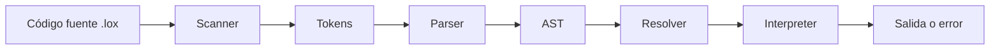

# Intérprete Tree-Walk de Lox

Trabajo Práctico de **Lenguajes y Compiladores  — FIUBA**.

El proyecto implementa en Python 3.12 un intérprete *Tree-Walk* para el lenguaje Lox. Recibe código fuente, reconoce sus tokens, construye un Árbol de Sintaxis Abstracta (AST), resuelve los ámbitos léxicos y finalmente ejecuta el árbol.

## Qué hace el TP

El intérprete soporta:

- Números, cadenas, booleanos y `nil`.
- Operadores aritméticos, de comparación y lógicos.
- Declaración, lectura y asignación de variables.
- Bloques con ámbitos anidados y *shadowing*.
- Sentencias `if`, `else`, `while` y `for`.
- Funciones, parámetros, retornos y recursión.
- Funciones anidadas y *closures*.
- Resolución estática de variables locales.
- Ejecución de archivos y consola interactiva REPL.
- Modos para inspeccionar tokens y el AST.


## Pipeline de ejecución



### 1. Scanner

[`src/lox/syntax/scanner.py`](src/lox/syntax/scanner.py) recorre el texto carácter por carácter. Convierte:

```lox
var resultado = 2 + 3;
```

en una secuencia equivalente a:

```text
Token(VAR, lexeme='var', literal=None, line=1)
Token(IDENTIFIER, lexeme='resultado', literal=None, line=1)
Token(EQUAL, lexeme='=', literal=None, line=1)
Token(NUMBER, lexeme='2', literal=2.0, line=1)
Token(PLUS, lexeme='+', literal=None, line=1)
Token(NUMBER, lexeme='3', literal=3.0, line=1)
Token(SEMICOLON, lexeme=';', literal=None, line=1)
Token(EOF, lexeme='', literal=None, line=1)
```

Cada token, definido en [`src/lox/syntax/token.py`](src/lox/syntax/token.py), conserva su tipo, lexema, valor literal, línea.

### 2. Parser y AST

[`src/lox/syntax/parser.py`](src/lox/syntax/parser.py) usa descenso recursivo para convertir los tokens en nodos de [`src/lox/syntax/ast.py`](src/lox/syntax/ast.py).

La expresión:

```lox
2 + 3 * 4
```

se representa como:

```text
       +
      / \
     2   *
        / \
       3   4
```

La estructura respeta la precedencia: primero se calcula `3 * 4` y después se suma `2`.

El `for` se desazucara en el parser. Este código:

```lox
for (var i = 0; i < 3; i = i + 1) {
    print i;
}
```

se convierte internamente en una estructura equivalente a:

```lox
{
    var i = 0;
    while (i < 3) {
        print i;
        i = i + 1;
    }
}
```

El intérprete no necesita un nodo especial para `for`.

### 3. Resolver

[`src/lox/semantics/resolver.py`](src/lox/semantics/resolver.py) realiza un recorrido previo del AST. Para cada referencia local calcula cuántos entornos debe subir el intérprete hasta llegar a la declaración correspondiente.

```text
Entorno actual       profundidad 0
      │
      ▼
Entorno exterior     profundidad 1
      │
      ▼
Entorno exterior     profundidad 2
```


### 4. Interpreter y runtime

[`src/lox/runtime/interpreter.py`](src/lox/runtime/interpreter.py) recorre el AST y ejecuta cada nodo. [`src/lox/runtime/environment.py`](src/lox/runtime/environment.py) almacena variables y conecta cada ámbito con su entorno exterior.

Las funciones están implementadas en [`src/lox/runtime/callable.py`](src/lox/runtime/callable.py). Cada `LoxFunction` guarda:

```python
self.declaration  # Parámetros y cuerpo de la función.
self.closure      # Entorno donde se declaró.
```

`return` usa una excepción interna para abandonar inmediatamente el cuerpo de la función:

```python
raise LoxReturnException(value)
```

La excepción es parte del control de flujo interno y es capturada por `LoxFunction`.

## Estructura del proyecto

```text
LyC-TP/
├── src/lox/
│   ├── syntax/
│   │   ├── token.py
│   │   ├── scanner.py
│   │   ├── ast.py
│   │   └── parser.py
│   ├── semantics/
│   │   └── resolver.py
│   ├── runtime/
│   │   ├── environment.py
│   │   ├── callable.py
│   │   └── interpreter.py
│   ├── errors.py
│   └── cli.py
├── tests/
├── benches/
└── pyproject.toml
```

## Instalación y uso

Requisitos:

- Python 3.12 o superior.
- [`uv`](https://docs.astral.sh/uv/).

Instalar las dependencias:

```bash
cd LyC-TP
uv sync
```

Ejecutar un archivo:

```bash
uv run pylox programa.lox
```

Abrir el REPL:

```bash
uv run pylox
```


Inspeccionar los tokens:

```bash
uv run pylox --scanner programa.lox
```

Inspeccionar el AST:

```bash
uv run pylox --ast programa.lox
```

## Comparación con la implementación de la cátedra

### 1. Tokens

#### Cátedra

La cátedra implementa `Token` como una clase mutable tradicional:

```python
TokenLiteralType = float | str | bool | None

class Token:
    def __init__(
        self,
        token_type: TokenType,
        *,
        lexeme: str,
        literal: TokenLiteralType,
        line: int,
    ):
        self.token_type = token_type
        self.lexeme = lexeme
        self.literal = literal
        self.line = line
```

El token conserva cuatro datos:

- `token_type`: significado sintáctico, como `NUMBER` o `VAR`.
- `lexeme`: caracteres originales del código.
- `literal`: valor ya convertido, por ejemplo `10.0`.
- `line`: línea donde apareció.

#### TP

El TP utiliza una dataclass inmutable:

```python
@dataclass(frozen=True)
class Token:
    token_type: TokenType
    lexeme: str
    literal: Any = None
    line: int = 1
```

`frozen=True` impide modificar accidentalmente un token después de crearlo. Se conserva la línea para ubicar los errores en el código fuente. Esto permite producir un diagnóstico como:

```text
[línea 3] Error en ')': Se esperaba una expresión.
```

### 2. Transformación de `for` en `while`

Ninguna implementación ejecuta directamente una sentencia `for`. El parser la transforma en nodos que el intérprete ya conoce. 

El programa:

```lox
for (var i = 0; i < 3; i = i + 1) {
    print i;
}
```

se convierte en una estructura equivalente a:

```lox
{
    var i = 0;

    while (i < 3) {
        print i;
        i = i + 1;
    }
}
```

La transformación tiene tres pasos:

1. El incremento se agrega al final del cuerpo.
2. La condición y el cuerpo se convierten en un `WhileStmt`.
3. El inicializador y el `while` se envuelven en un `BlockStmt`.


### 3. Manejo de errores

Las implementaciones difieren tanto en los tipos de error como en la posibilidad de continuar analizando el programa.

#### Cátedra

La cátedra usa principalmente excepciones estándar:

```python
raise Exception("Unterminated string")
raise SyntaxError("Expected expression")
raise NameError("Variable already exists")
raise RuntimeError("Undefined variable")
```

La CLI delimita cada etapa con `try/except`:

```python
try:
    tokens = scanner.scan()
except Exception as error:
    print(f"Scanning Error: {error}")
    return

try:
    statements = parser.parse()
except Exception as error:
    print(f"Parsing Error: {error}")
    return
```

Cuando aparece un error, esa ejecución se detiene. La opción `--debug` permite mostrar el traceback de Python, lo cual resulta útil durante el desarrollo del intérprete.

#### TP

El TP define tipos específicos según la etapa:

```python
class LoxError(Exception):
    pass

class LoxLexicalError(LoxError):
    pass

class LoxSyntaxError(LoxError):
    pass

class LoxResolutionError(LoxError):
    pass

class LoxRuntimeError(LoxError):
    pass
```

`DiagnosticReporter` conserva el estado general de la ejecución:

```python
class DiagnosticReporter:
    def __init__(self):
        self.had_error = False
        self.had_runtime_error = False

    def report_error(self, line, where, message):
        self.had_error = True
        print(
            f"[línea {line}] Error{where}: {message}",
            file=sys.stderr,
        )
```

El scanner puede informar un carácter inválido y continuar reconociendo los caracteres siguientes. El parser usa recuperación en modo pánico:

```python
def _synchronize(self):
    self._advance()

    while not self._is_at_end():
        if self._previous().token_type == TokenType.SEMICOLON:
            return

        if self._peek().token_type in (
            TokenType.FUN,
            TokenType.VAR,
            TokenType.FOR,
            TokenType.IF,
            TokenType.WHILE,
            TokenType.PRINT,
            TokenType.RETURN,
        ):
            return

        self._advance()
```

Después de un error, descarta tokens hasta encontrar un `;` o el comienzo probable de otra declaración. Esto evita interpretar el resto de una sentencia inválida como muchos errores independientes.

Finalmente, la CLI usa códigos de salida diferenciados:

```python
if self.diagnostics.had_error:
    sys.exit(65)

if self.diagnostics.had_runtime_error:
    sys.exit(70)
```

La diferencia práctica es que la cátedra presenta un mecanismo más directo, basado en lanzar y capturar excepciones. El TP separa errores léxicos, sintácticos, semánticos y de ejecución, incluye línea e intenta recuperar el análisis cuando es posible.

### 4. AST

El AST representa la estructura del programa sin conservar detalles innecesarios como espacios o comentarios. Para:

```lox
2 + 3 * 4
```


#### Cátedra

Los nodos son clases mutables que solamente almacenan datos:

```python
class BinaryExpr(Expr):
    def __init__(self, left: Expr, operator: Token, right: Expr):
        self.left = left
        self.operator = operator
        self.right = right
```

El AST está dividido entre `Expr.py` y `Stmt.py`. Para operar sobre un nodo, el intérprete o el resolver inspeccionan su tipo mediante `singledispatchmethod`.

#### TP

Los nodos son dataclasses inmutables y participan del patrón Visitor:

```python
@dataclass(frozen=True)
class BinaryExpr(Expr):
    left: Expr
    operator: Token
    right: Expr

    def accept(self, visitor: ExprVisitor):
        return visitor.visit_binary_expr(self)
```

La clase base exige que todos los nodos implementen `accept()`:

```python
class Expr(ABC):
    @abstractmethod
    def accept(self, visitor: "ExprVisitor[T]") -> T:
        pass
```

El contrato del visitante declara todas las operaciones disponibles:

```python
class ExprVisitor(ABC):
    @abstractmethod
    def visit_binary_expr(self, expr: "BinaryExpr"):
        pass

    @abstractmethod
    def visit_literal_expr(self, expr: "LiteralExpr"):
        pass
```

El mismo nodo puede enviarse a distintos visitantes:

```text
BinaryExpr.accept(Interpreter) → ejecuta la operación
BinaryExpr.accept(Resolver)    → resuelve sus operandos
BinaryExpr.accept(AstPrinter)  → genera texto del árbol
```

La diferencia central es de diseño. En la cátedra, la operación decide qué hacer según el tipo recibido. En el TP, el nodo redirige explícitamente al método apropiado del visitante. Los datos representados por el árbol son casi idénticos.

### 5. Cómo se guardan las distancias léxicas

El Resolver calcula la cantidad de entornos que separan el uso de una variable de su declaración. Por ejemplo:

```lox
{
    var a = "exterior";

    {
        print a;
    }
}
```

Cuando se ejecuta `print a`, la variable está a una distancia de un entorno:

```text
Entorno del print       distancia 0
        │
        ▼
Entorno que contiene a  distancia 1
```

#### Cátedra

La cátedra usa el propio objeto `VariableExpr` o `AssignmentExpr` como clave:

```python
self.local_scope_depths: dict[
    VariableExpr | AssignmentExpr,
    int,
] = {}

def resolve_depth(self, expression, depth):
    self.local_scope_depths[expression] = depth
```

Durante la ejecución consulta ese mismo objeto:

```python
if expression in self.local_scope_depths:
    depth = self.local_scope_depths[expression]
    return self.env.get(expression.name.lexeme, depth)

return self.globals.get(expression.name.lexeme)
```

Las clases del AST de la cátedra no implementan igualdad estructural, por lo que Python compara esos objetos por identidad. Dos expresiones escritas igual siguen siendo claves diferentes.

#### TP

El TP almacena explícitamente la identidad numérica del nodo:

```python
self.locals: dict[int, int] = {}

def resolve(self, expr: Expr, depth: int):
    self.locals[id(expr)] = depth
```

Después consulta `id(expr)`:

```python
def _look_up_variable(self, name: Token, expr: Expr):
    distance = self.locals.get(id(expr))

    if distance is not None:
        return self.environment.get_at(distance, name.lexeme)

    return self.globals.get(name)
```

Esto es relevante porque las dataclasses del TP tienen igualdad estructural. Dos nodos con los mismos campos podrían compararse como iguales. Al usar `id(expr)`, cada aparición concreta del código conserva su propia resolución, aunque otra expresión tenga la misma forma.

Para una asignación se reutiliza la distancia:

```python
distance = self.locals.get(id(expr))

if distance is not None:
    self.environment.assign_at(distance, expr.name, value)
else:
    self.globals.assign(expr.name, value)
```

Ambas implementaciones optimizan la búsqueda de la misma manera: el Resolver hace el trabajo una vez y el Interpreter salta directamente al entorno correcto. La diferencia es si la clave del diccionario es el objeto expresión o `id(expr)`.

### 6. Interpreter

Las dos versiones son intérpretes Tree-Walk: ejecutan el programa recorriendo recursivamente el AST. La mayor diferencia es el mecanismo de despacho utilizado para seleccionar la operación de cada nodo.

#### Cátedra: `singledispatchmethod`

```python
@singledispatchmethod
def evaluate(self, expression: Expr):
    raise RuntimeError(
        f"Unknown expression type: {type(expression)}"
    )

@evaluate.register
def _(self, expression: LiteralExpr):
    return expression.value

@evaluate.register
def _(self, expression: BinaryExpr):
    left = self.evaluate(expression.left)
    right = self.evaluate(expression.right)
    # Aplicar expression.operator.
```

Python inspecciona dinámicamente el tipo del argumento y busca la implementación registrada.

El flujo es:

```text
evaluate(binary_expr)
→ singledispatch busca BinaryExpr
→ ejecuta la función registrada para BinaryExpr
```

#### TP: Visitor

```python
def evaluate(self, expr: Expr):
    return expr.accept(self)

def visit_literal_expr(self, expr: LiteralExpr):
    return expr.value

def visit_binary_expr(self, expr: BinaryExpr):
    left = self.evaluate(expr.left)
    right = self.evaluate(expr.right)
    # Aplicar expr.operator.
```

El nodo realiza una llamada directa al visitante:

```python
def accept(self, visitor):
    return visitor.visit_binary_expr(self)
```

El flujo es:

```text
evaluate(binary_expr)
→ binary_expr.accept(interpreter)
→ interpreter.visit_binary_expr(binary_expr)
```

La semántica de suma, resta, bucles y funciones permanece muy próxima. Lo que cambia es cómo se llega al código que implementa cada operación.

El TP también centraliza los errores de ejecución:

```python
try:
    for statement in statements:
        self.execute(statement)
except LoxRuntimeError as error:
    self.diagnostics.report_runtime_error(error)
```

Y normaliza la salida mediante `stringify()`, por ejemplo mostrando `10` en lugar de `10.0`. La cátedra imprime directamente el objeto de Python:

```python
value = self.evaluate(statement.expression)
print(value)
```


## Benchmark: bucle grande

Se compararon ambas implementaciones ejecutando exactamente [`benches/programs/large_loop.lox`](benches/programs/large_loop.lox):

```lox
var sum = 0;
for (var i = 0; i < 500000; i = i + 1) {
    sum = sum + (i % 7);
}
print sum;
```

La salida de ambas implementaciones se valida numéricamente como `1499994` antes de aceptar cada medición.


### Resultados

| Implementación | Tiempo |
|---|---:|
| TP | **1,2685 s** | 
| Cátedra | 6,2798 s |

Una explicación probable es el costo de `singledispatchmethod` en la implementación de la cátedra. Dentro de un bucle, cada condición, lectura, asignación y operación atraviesa repetidamente ese mecanismo de despacho. El TP realiza llamadas directas desde `accept()` hacia los métodos Visitor. 


Ejecutarlo desde `LyC-TP`:

```bash
.venv/bin/python benches/compare_loop.py 7
```

El argumento final indica la cantidad de repeticiones medidas.

## Tests

Ejecutar los tests propios:

```bash
uv run pytest -q
```

Resultado actual:

```text
90 passed
```

Ejecutar la suite oficial de la cátedra:

```bash
python3 ../Practica/plox/real-tests/script.py "uv run pylox"
```

La implementación pasa:

```text
0-simple.lox
1-flow.lox
2-functions.lox
3-minsky.lox
4-fizzbuzz.lox

| Todo OK |
```

