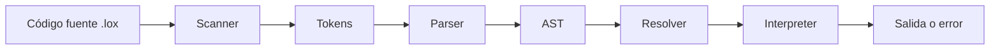

# Intérprete Tree-Walk de Lox

Trabajo Práctico de **Lenguajes y Compiladores  — FIUBA**.

El proyecto implementa en Python 3.12 un intérprete *Tree-Walk* para el lenguaje Lox. Recibe código fuente, reconoce sus tokens, construye un Árbol de Sintaxis Abstracta (AST), resuelve los ámbitos léxicos y finalmente ejecuta el árbol.

Jiangjie Chen - 109747

## Qué hace el TP

El intérprete soporta:

- Números, cadenas, booleanos y `nil`.
- Operadores aritméticos, de comparación y lógicos.
- Declaración, lectura y asignación de variables.
- Bloques con ámbitos anidados y *shadowing*.
- Sentencias `if`, `else`, `while` y `for`.
- Funciones, parámetros, retornos y recursión.
- Funciones anidadas y *closures*.
- Resolución estática de variables locales.
- Ejecución de archivos y consola interactiva REPL.
- Modos para inspeccionar tokens y el AST.


## Pipeline de ejecución



### 1. Scanner y Token

[`scanner.py`](src/lox/syntax/scanner.py) recorre el código carácter por carácter y genera objetos definidos en [`token.py`](src/lox/syntax/token.py):

```python
@dataclass(frozen=True)
class Token:
    token_type: TokenType
    lexeme: str
    literal: Any = None
    line: int = 1
```

El scanner guarda el comienzo del lexema en `start` y la posición actual en `current`:

```python
def scan_tokens(self) -> list[Token]:
    while not self._is_at_end():
        self.start = self.current
        self.scan_token()

    self.tokens.append(
        Token(
            token_type=TokenType.EOF,
            lexeme="",
            literal=None,
            line=self.line,
        )
    )
    return self.tokens
```

`scan_token()` reconoce símbolos, operadores, números, cadenas, identificadores y palabras reservadas:

```python
c = self._advance()

match c:
    case "+":
        self._add_token(TokenType.PLUS)
    case "=":
        token_type = TokenType.EQUAL_EQUAL if self._match("=") else TokenType.EQUAL
        self._add_token(token_type)
    case _ if c.isdigit():
        self._number()
    case _ if c.isalpha() or c == "_":
        self._identifier()
```

Así, `var resultado = 2 + 3;` produce:

```text
Token(VAR, lexeme='var', literal=None, line=1)
Token(IDENTIFIER, lexeme='resultado', literal=None, line=1)
Token(EQUAL, lexeme='=', literal=None, line=1)
Token(NUMBER, lexeme='2', literal=2.0, line=1)
Token(PLUS, lexeme='+', literal=None, line=1)
Token(NUMBER, lexeme='3', literal=3.0, line=1)
Token(EOF, lexeme='', literal=None, line=1)
```

### 2. Parser

[`parser.py`](src/lox/syntax/parser.py) recibe los tokens y construye el AST mediante descenso recursivo.

Eg: La suma se procesa en `_term()`, que obtiene sus operandos mediante `_factor()`:

```python
def _term(self) -> Expr:
    expr = self._factor()

    while self._match(TokenType.MINUS, TokenType.PLUS):
        operator = self._previous()
        right = self._factor()
        expr = BinaryExpr(left=expr, operator=operator, right=right)

    return expr
```

La multiplicación se procesa antes en `_factor()`. Por eso `2 + 3 * 4` se interpreta como `2 + (3 * 4)`.

Los valores elementales se convierten en nodos dentro de `_primary()`:

```python
if self._match(TokenType.NUMBER, TokenType.STRING):
    return LiteralExpr(self._previous().literal)

if self._match(TokenType.IDENTIFIER):
    return VariableExpr(name=self._previous())
```

### 3. AST

[`ast.py`](src/lox/syntax/ast.py) define nodos inmutables para expresiones y sentencias. Cada nodo implementa `accept()` para participar del patrón Visitor:

```python
@dataclass(frozen=True)
class BinaryExpr(Expr):
    left: Expr
    operator: Token
    right: Expr

    def accept(self, visitor: ExprVisitor) -> Any:
        return visitor.visit_binary_expr(self)
```

Para `2 + 3 * 4`, el parser construye:

```text
       +
      / \
     2   *
        / \
       3   4
```

El mismo árbol puede ser recorrido por `Resolver`, `Interpreter` y `AstPrinter`, cada uno con una operación diferente.

### 4. Resolver

[`resolver.py`](src/lox/semantics/resolver.py) calcula cuántos entornos separan cada uso de una variable local de su declaración:

```python
def _resolve_local(self, expr: Expr, name: Token) -> None:
    for i in range(len(self.scopes) - 1, -1, -1):
        if name.lexeme in self.scopes[i]:
            depth = len(self.scopes) - 1 - i
            self.interpreter.resolve(expr, depth)
            return
```

El intérprete guarda esa distancia con `self.locals[id(expr)] = depth` y puede acceder directamente al entorno correcto.

### 5. Interpreter

[`interpreter.py`](src/lox/runtime/interpreter.py) ejecuta el AST mediante Visitor:

```python
def evaluate(self, expr: Expr) -> Any:
    return expr.accept(self)

def execute(self, stmt: Stmt) -> Any:
    return stmt.accept(self)
```

Una declaración evalúa su inicializador y guarda el resultado en el entorno actual:

```python
def visit_var_decl(self, stmt: VarDecl) -> Any:
    value = None
    if stmt.initializer is not None:
        value = self.evaluate(stmt.initializer)

    self.environment.define(stmt.name.lexeme, value)
    return None
```

Una operación binaria evalúa primero ambos operandos y luego aplica el operador con validación de tipos:

```python
def visit_binary_expr(self, expr: BinaryExpr) -> Any:
    left = self.evaluate(expr.left)
    right = self.evaluate(expr.right)

    match expr.operator.token_type:
        case TokenType.STAR:
            self._check_number_operands(expr.operator, left, right)
            return float(left) * float(right)

        case TokenType.PLUS:
            if self._is_number(left) and self._is_number(right):
                return float(left) + float(right)
            if isinstance(left, str) and isinstance(right, str):
                return left + right
            raise LoxRuntimeError(
                "Los operandos deben ser dos números o dos cadenas de texto.",
                token=expr.operator,
            )
```

Para `var resultado = 2 + 3 * 4;`, el parser construye `2 + (3 * 4)`, el intérprete calcula primero `3 * 4`, luego suma `2` y finalmente guarda `resultado = 14`.

## Estructura del proyecto

```text
LyC-TP/
├── src/lox/
│   ├── syntax/
│   │   ├── token.py
│   │   ├── scanner.py
│   │   ├── ast.py
│   │   └── parser.py
│   ├── semantics/
│   │   └── resolver.py
│   ├── runtime/
│   │   ├── environment.py
│   │   ├── callable.py
│   │   └── interpreter.py
│   ├── errors.py
│   └── cli.py
├── tests/
├── benches/
└── pyproject.toml
```

## Instalación y uso

Requisitos:

- Python 3.12 o superior.
- [`uv`](https://docs.astral.sh/uv/).

Desde la carpeta que contiene `LyC-TP`, instalar el proyecto y sus dependencias:

```bash
cd LyC-TP
uv sync
```

Ejecutar un archivo:

```bash
uv run pylox example.lox
```

Abrir el REPL:

```bash
uv run pylox
```

Inspeccionar los tokens:

```bash
uv run pylox --scanner
```

Inspeccionar los tokens con un ejemplo:

```bash
uv run pylox --scanner example.lox
```

Inspeccionar el AST:

```bash
uv run pylox --ast
```

Inspeccionar el AST con un ejemplo:

```bash
uv run pylox --ast example.lox
```


## Comparación con la implementación de la cátedra

### 1. Tokens

#### Cátedra

La cátedra implementa `Token` como una clase mutable tradicional:

```python
TokenLiteralType = float | str | bool | None

class Token:
    def __init__(
        self,
        token_type: TokenType,
        *,
        lexeme: str,
        literal: TokenLiteralType,
        line: int,
    ):
        self.token_type = token_type
        self.lexeme = lexeme
        self.literal = literal
        self.line = line
```

El token conserva cuatro datos:

- `token_type`: significado sintáctico, como `NUMBER` o `VAR`.
- `lexeme`: caracteres originales del código.
- `literal`: valor ya convertido, por ejemplo `10.0`.
- `line`: línea donde apareció.

#### TP

El TP utiliza una dataclass inmutable:

```python
@dataclass(frozen=True)
class Token:
    token_type: TokenType
    lexeme: str
    literal: Any = None
    line: int = 1
```

`frozen=True` impide modificar accidentalmente un token después de crearlo. Se conserva la línea para ubicar los errores en el código fuente. Esto permite producir un diagnóstico como:

```text
lox> print (1 + );
[línea 1] Error en ')': Se esperaba una expresión válida, se obtuvo ')'.
```

### 2. Transformación de `for` en `while`

Ninguna implementación ejecuta directamente una sentencia `for`. El parser la transforma en nodos que el intérprete ya conoce. 

El programa:

```lox
for (var i = 0; i < 3; i = i + 1) {
    print i;
}
```

se convierte en una estructura equivalente a:

```lox
{
    var i = 0;

    while (i < 3) {
        print i;
        i = i + 1;
    }
}
```

La transformación tiene tres pasos:

1. El incremento se agrega al final del cuerpo.
2. La condición y el cuerpo se convierten en un `WhileStmt`.
3. El inicializador y el `while` se envuelven en un `BlockStmt`.


### 3. Manejo de errores

Las implementaciones difieren tanto en los tipos de error como en la posibilidad de continuar analizando el programa.

#### Cátedra

La cátedra usa principalmente excepciones estándar:

```python
raise Exception("Unterminated string")
raise SyntaxError("Expected expression")
raise NameError("Variable already exists")
raise RuntimeError("Undefined variable")
```

La CLI delimita cada etapa con `try/except`:

```python
try:
    tokens = scanner.scan()
except Exception as error:
    print(f"Scanning Error: {error}")
    return

try:
    statements = parser.parse()
except Exception as error:
    print(f"Parsing Error: {error}")
    return
```

Cuando aparece un error, esa ejecución se detiene. La opción `--debug` permite mostrar el traceback de Python, lo cual resulta útil durante el desarrollo del intérprete.

#### TP

El TP define tipos específicos según la etapa:

```python
class LoxError(Exception):
    pass

class LoxLexicalError(LoxError):
    pass

class LoxSyntaxError(LoxError):
    pass

class LoxResolutionError(LoxError):
    pass

class LoxRuntimeError(LoxError):
    pass
```

`DiagnosticReporter` conserva el estado general de la ejecución:

```python
class DiagnosticReporter:
    def __init__(self):
        self.had_error = False
        self.had_runtime_error = False

    def report_error(self, line, where, message):
        self.had_error = True
        print(
            f"[línea {line}] Error{where}: {message}",
            file=sys.stderr,
        )
```

El scanner puede informar un carácter inválido y continuar reconociendo los caracteres siguientes. El parser usa recuperación en modo pánico:

```python
def _synchronize(self):
    self._advance()

    while not self._is_at_end():
        if self._previous().token_type == TokenType.SEMICOLON:
            return

        if self._peek().token_type in (
            TokenType.FUN,
            TokenType.VAR,
            TokenType.FOR,
            TokenType.IF,
            TokenType.WHILE,
            TokenType.PRINT,
            TokenType.RETURN,
        ):
            return

        self._advance()
```

Después de un error, descarta tokens hasta encontrar un `;` o el comienzo probable de otra declaración. Esto evita interpretar el resto de una sentencia inválida como muchos errores independientes.

Finalmente, la CLI usa códigos de salida diferenciados:

```python
if self.diagnostics.had_error:
    sys.exit(65)

if self.diagnostics.had_runtime_error:
    sys.exit(70)
```

La diferencia práctica es que la cátedra presenta un mecanismo más directo, basado en lanzar y capturar excepciones. El TP separa errores léxicos, sintácticos, semánticos y de ejecución, incluye línea.

### 4. AST: representación de los nodos

Ambas implementaciones representan expresiones y sentencias mediante nodos del AST. Por ejemplo, una expresión binaria almacena el operando izquierdo, el operador y el operando derecho.

#### Cátedra

Los nodos son clases mutables con un constructor explícito:

```python
class BinaryExpr(Expr):
    def __init__(self, left: Expr, operator: Token, right: Expr):
        self.left = left
        self.operator = operator
        self.right = right
```

El AST está dividido entre `Expr.py` y `Stmt.py`. Los atributos de sus nodos pueden modificarse después de crearlos.

#### TP

Los nodos se definen en `ast.py` mediante dataclasses con `frozen=True`. Este fragmento muestra sus campos; el método `accept()` se explica en la sección del intérprete:

```python
@dataclass(frozen=True)
class BinaryExpr(Expr):
    left: Expr
    operator: Token
    right: Expr
    # Método accept() omitido en este fragmento.
```

La dataclass genera el constructor y la comparación por campos. `frozen=True` impide reasignar sus atributos después de crear el nodo; no vuelve inmutables automáticamente los objetos que esos atributos contienen.

La información representada es prácticamente la misma. La diferencia está en cómo se definen los nodos y si sus atributos pueden modificarse. La forma de recorrerlos se compara en [Interpreter](#6-interpreter).

### 5. Cómo se guardan las distancias léxicas

El Resolver calcula la cantidad de entornos que separan el uso de una variable de su declaración. Por ejemplo:

```lox
{
    var a = "exterior";

    {
        print a;
    }
}
```

Cuando se ejecuta `print a`, la variable está a una distancia de un entorno:

```text
Entorno del print       distancia 0
        │
        ▼
Entorno que contiene a  distancia 1
```

#### Cátedra

La cátedra usa el propio objeto `VariableExpr` o `AssignmentExpr` como clave:

```python
self.local_scope_depths: dict[
    VariableExpr | AssignmentExpr,
    int,
] = {}

def resolve_depth(self, expression, depth):
    self.local_scope_depths[expression] = depth
```

Durante la ejecución consulta ese mismo objeto:

```python
if expression in self.local_scope_depths:
    depth = self.local_scope_depths[expression]
    return self.env.get(expression.name.lexeme, depth)

return self.globals.get(expression.name.lexeme)
```

Las clases del AST de la cátedra no implementan igualdad estructural, por lo que Python compara esos objetos por identidad. Dos expresiones escritas igual siguen siendo claves diferentes.

#### TP

El TP almacena explícitamente la identidad numérica del nodo:

```python
self.locals: dict[int, int] = {}

def resolve(self, expr: Expr, depth: int):
    self.locals[id(expr)] = depth
```

Después consulta `id(expr)`:

```python
def _look_up_variable(self, name: Token, expr: Expr):
    distance = self.locals.get(id(expr))

    if distance is not None:
        return self.environment.get_at(distance, name.lexeme)

    return self.globals.get(name)
```

Esto es relevante porque las dataclasses del TP tienen igualdad estructural. Dos nodos con los mismos campos podrían compararse como iguales. Al usar `id(expr)`, cada aparición concreta del código conserva su propia resolución, aunque otra expresión tenga la misma forma.

Para una asignación se reutiliza la distancia:

```python
distance = self.locals.get(id(expr))

if distance is not None:
    self.environment.assign_at(distance, expr.name, value)
else:
    self.globals.assign(expr.name, value)
```

Ambas implementaciones optimizan la búsqueda de la misma manera: el Resolver hace el trabajo una vez y el Interpreter salta directamente al entorno correcto. La diferencia es si la clave del diccionario es el objeto expresión o `id(expr)`.

### 6. Interpreter

Las dos versiones son intérpretes Tree-Walk: ejecutan el programa recorriendo recursivamente el AST. La mayor diferencia es el mecanismo de despacho utilizado para seleccionar la operación de cada nodo.

#### Cátedra: `singledispatchmethod`

```python
@singledispatchmethod
def evaluate(self, expression: Expr):
    raise RuntimeError(
        f"Unknown expression type: {type(expression)}"
    )

@evaluate.register
def _(self, expression: LiteralExpr):
    return expression.value

@evaluate.register
def _(self, expression: BinaryExpr):
    left = self.evaluate(expression.left)
    right = self.evaluate(expression.right)
    # Aplicar expression.operator.
```

Python inspecciona dinámicamente el tipo del argumento y busca la implementación registrada.

El flujo es:

```text
evaluate(binary_expr)
→ singledispatch busca BinaryExpr
→ ejecuta la función registrada para BinaryExpr
```

#### TP: Visitor

Visitor es el patrón que permite realizar distintas operaciones sobre el AST. `Interpreter` es uno de sus visitantes: implementa métodos como `visit_literal_expr()` y `visit_binary_expr()`, mientras que cada nodo implementa `accept()` para llamar al método correspondiente.

```python
def evaluate(self, expr: Expr):
    return expr.accept(self)

def visit_literal_expr(self, expr: LiteralExpr):
    return expr.value

def visit_binary_expr(self, expr: BinaryExpr):
    left = self.evaluate(expr.left)
    right = self.evaluate(expr.right)
    # Aplicar expr.operator.
```

El nodo realiza una llamada directa al visitante:

```python
def accept(self, visitor):
    return visitor.visit_binary_expr(self)
```

El flujo es:

```text
evaluate(binary_expr)
→ binary_expr.accept(interpreter)
→ interpreter.visit_binary_expr(binary_expr)
```

La clase base `Expr` exige implementar `accept()`, y `ExprVisitor` define los métodos que debe ofrecer un visitante. El mismo mecanismo también permite que `Resolver` analice las variables y que `AstPrinter` genere una representación textual de las expresiones.

La semántica de suma, resta, bucles y funciones permanece muy próxima. Lo que cambia es cómo se llega al código que implementa cada operación.

El TP también centraliza los errores de ejecución:

```python
try:
    for statement in statements:
        self.execute(statement)
except LoxRuntimeError as error:
    self.diagnostics.report_runtime_error(error)
```

Y normaliza la salida mediante `stringify()`, por ejemplo mostrando `10` en lugar de `10.0`. La cátedra imprime directamente el objeto de Python:

```python
value = self.evaluate(statement.expression)
print(value)
```


## Benchmark: bucle grande

Se compararon ambas implementaciones ejecutando exactamente [`benches/programs/large_loop.lox`](benches/programs/large_loop.lox):

```lox
var sum = 0;
for (var i = 0; i < 500000; i = i + 1) {
    sum = sum + (i % 7);
}
print sum;
```

La salida de ambas implementaciones se valida numéricamente como `1499994` antes de aceptar cada medición.


### Resultados

| Implementación | Tiempo |
|---|---:|
| TP | **1,2685 s** | 
| Cátedra | 6,2798 s |

En el benchmark se ejecutó el mismo programa, con un bucle de 500.000 iteraciones, en ambas implementaciones. El TP tardó aproximadamente 1,27 segundos y la versión de cátedra 6,28 segundos, por lo que el TP fue unas cinco veces más rápido en esta prueba.

Una explicación probable es cómo cada intérprete selecciona la operación que corresponde a un nodo del AST. La cátedra utiliza `singledispatchmethod`, que selecciona el método según el tipo del nodo. El TP utiliza el patrón Visitor: cada nodo llama explícitamente al método que lo procesa. Esto puede reducir el costo de seleccionar la operación.


## Tests

Ejecutar los tests propios:

```bash
uv run --extra dev pytest -q
```

`pytest` es una dependencia opcional del extra `dev`: `uv sync` no lo instala por defecto. Usá `--extra dev` al ejecutar las pruebas para asegurar que esté disponible.

Resultado actual:

```text
89 passed
```

Ejecutar la copia incluida de la suite oficial de la cátedra:

```bash
python3 tests/real_tests/script.py "uv run pylox"
```


La implementación pasa:

```text
0-simple.lox
1-flow.lox
2-functions.lox
3-minsky.lox
4-fizzbuzz.lox

| Todo OK |
```
